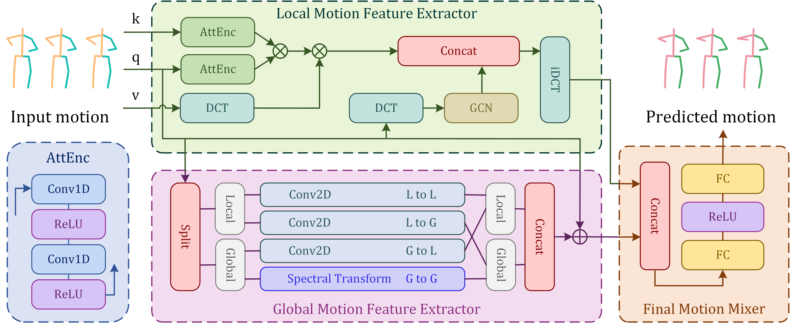

# A Dual-Path Attention Fourier Convolutional Network for Human Motion Prediction

This repository is the official implementation of the paper "A Dual-Path Attention Fourier Convolutional Network for Human Motion Prediction" (IJCRSET#177). [[Paper Link](https://urfjournals.org/open-access/a-dual-path-attention-fourier-convolutional-network-for-human-motionrnprediction.pdf)] 



## Abstract

Human Motion Prediction is developed to project human motion in the future frames. With lots of papers tend to predict
the
future motion via Recurrent Neural Network, Multi-Layer Perceptron, or Graph Convolution Network,
many complicated motions have been predicted more accurately. However, most existing methods have met drawbacks in
longterm predictions. To make the long-term prediction better, we propose a network called DAFCN, using Fast Fourier
Convolution
to optimize the result on long-term human motion prediction. Our approach also makes advantages of the Motion Attention
Model to abstract the short-term useful information. Furthermore, our approach attempts to make prediction in short-term
and long-term paths, which will be mixed in the output layers. Currently, our approach is experimented on Human3.6M,
which
demonstrate a better result on prediction. The code is available
at: [https://github.com/Kiramei/DAFCN](https://github.com/Kiramei/DAFCN)

### Before you start

1. Install the required packages:

```bash
pip install -r requirements.txt
```

2. You'd install `Pytorch` separately. The version of `Pytorch` should be compatible with your CUDA version. You can
   find the installation command [here](https://pytorch.org/get-started/locally/).

### To train:

before training, please download the dataset and put it in a certain folder. The dataset should be organized as follows:

```
path/to/dataset
│
└── Human3.6M
    ├── S1
    │   ├── 1
    │   ├── 2
    │   ...
    │    
    ├── S5
    │   ├── 1
    │   ├── 2
    │   ├── 3
    │   ...
    │ ...
```

Then, run the following command:

```bash
python train.py --data_dir path/to/dataset/Human3.6M
```

### To test:

To test the model, you may use the following command:

```bash
python test.py --data_dir path/to/dataset/Human3.6M --model_path checkpoint/train_in50_out10_ks10_dctn20
```

And the result file will be presented in `checkpoint/train_in50_out10_ks10_dctn20`.

# Citation

```PlainText
@article{lu2025dual,
  author       = {Chengjie Lu},
  title        = {A Dual-Path Attention Fourier Convolutional Network for Human Motion Prediction},
  journal      = {International Journal of Current Research in Science, Engineering and Technology},
  year         = {2025},
  volume       = {8},
  number       = {1},
  pages        = {275--279},
  doi          = {10.30967/IJCRSET/Chengjie-Lu/177}
}
```